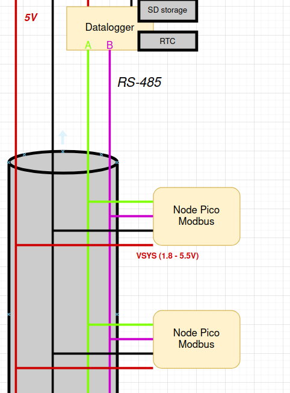

# Ecophys-Modbus
Using Pi Picos, RS485 and ModBus to create robust environmental networks that are able to operate in constrained conditions (low access to ressources, harsh climate, etc).

- [Ecophys-Modbus](#ecophys-modbus)
  * [Objectives](#objectives)
  * [Hardware](#hardware)
    + [Host](#host)
    + [Clients](#clients)
    + [Cable](#cable)
    + [Interconnection](#interconnection)
  * [Software](#software)
    + [ModBus](#Why-use-ModBus)
    + [Host](#Host)
    + [Clients](#Clients) 
  * [Sensors used in this project](#sensors-used-in-this-project)
    + [Microclimate-SHT45](#Microclimate-SHT45)
    + [DS18B20](#ds18b20)
    + [Dendrometer-ADS1115](#Dendrometer-ADS1115)

## Objectives

We aim to build a low-cost, robust and resilient sensor network to characterize heterogeneous environments. In our case we work mainly in complex cocoa agroforestry systems in Central Africa (Cameroon). These systems are multi-layered and have a high diverity of shade and understory trees. In this context placing a few micro-environmental sensors is not sufficient to guarantee a good estimation of the effects of shade trees on the micro-evironment of cocoa trees.

## Hardware

### Host
The Host of our network is either a Pi Pico microcontroller with an adafruit datalogging shield or a RS-485 capable datalogger such as those provided by Campbell scientific.
#### Datalogger Host
The datalogger host is made up of a Pi Pico with an Adafruit Pi Cowbell datalogger shield ([here](https://learn.adafruit.com/adafruit-picowbell-adalogger-for-pico?view=all)). This is useful since it includes both a real-time clock with a separate battery and an SD card holder that allows us to store more data than on the filesystem of the Pi itself. There are potentially other datalogging shields on the market. 
### Clients
Clients of the network are Pi Picos ([here](https://www.raspberrypi.com/products/raspberry-pi-pico/)) with a UART to RS-485 Grove module from Seed Studio ([here](https://wiki.seeedstudio.com/Grove-RS485/)). They are meant to consume the least power possible whilst still reading useful sensors by sleeping as much as possible.
### Cable
For the clients and the host to communicate we need to used a cable that is cable of transporting: power to the devices, A line of RS-485, B line of RS-485 and GND. We found that the most adapted cable for this use was the RJ45 cable. It is readily availble in Cameroon and has a total of 4 twisted pairs. One twisted pair is for A and B lines of RS485, one twisted pair is for +3V and one twisted pair + external shielding is for GND.
### Interconnection
For the interconnections at each node we will use 3-way wago connectors, one for each (+V, GND, A, B). 

## Software
The software for this project is written in micropython for its ease of use by beginners. This is useful since these sensors are meant to be used by ecologists and biologists not people with big programming backgrounds. In this network efficiency is not a big issue and computing power neither. The use of the Pico on which micropython runs like a charm is also a reason. 

### Why use ModBus
Simply put [ModBus](https://en.wikipedia.org/wiki/Modbus) is the communications protocol that allows the devices on the network to communicate in an orderly fashion. There are hosts (ex-master) and clients (ex-slaves). There is only one host per network and up to 36 clients. The host is the only one that can call to clients to retrieve or write data. ModBus provides a useful framework for serial communication by standardising communication, checking for errors and avoiding conflicts. Clients each have a disctinctive address. Client devices have four different data structures: coils (1 bit), discrete inputs (1 bit), input registers (16 bits), and holding registers (16 bits). The host can read/write coils that are used for on/off operations mainly. Discrete inputs are read-only and are used to check status. Input registers are read-only and are used to store measurement values. Holding registers are read/write and used to store parameters. This is juste a very brief and simplified explananation but more can be read at these addresses: [https://www.lammertbies.nl/comm/info/modbus](https://www.lammertbies.nl/comm/info/modbus), [https://csimn.com/MHelp-VP3-TM/vp3-tm-appendix-C.html](https://csimn.com/MHelp-VP3-TM/vp3-tm-appendix-C.html)

The software is divided in two main categories: the [/Software/host.py](/Software/host.py) device and the [/Software/client.py](/Software/client.py) devices. The devices make use of the [micropython-modbus](https://github.com/brainelectronics/micropython-modbus?tab=readme-ov-file) library which provides all the functions necessary for RTU ModBus communication. The information about each device (ID, sensors, etc) is not hardcoded but is read by either the host or the client micropython program from a json file on the device. Example jsons for both host and clients are availabe in the [Examples](/Software/Example_jsons/) directory. This means that all client devices on the network share the same client.py file with different client.json files. 
### Host

### Clients
The clients are meant to read sensor data, store it in their holding registers and return it when called by the host device. Since this project is powered by solar panels and batteries in the field they must be optimised for minimal consumption.

#### Handling Energy consumption
The clients are built to stay the least time possible in an active mode and quickly go back to sleep. This is done by the host putting the clients to sleep by setting the appropriate coil to 0 (see client.py). On the Pi Pico there are a few ways to get the device to sleep. The _time.delay(s)_ function that merely acts as a delay in the code. The _machine.lightsleep(ms)_ and _machine.deepsleep(ms)_ which pause code execution and put the microcontroller in low power mode. Since for the Pico energy consumption is comparable in _machine.lightsleep()_ and _machine.deeplseep()_ when a timeout is specified, it is easier to just use the _lightsleep_ when energy saving is needed. It might be useful however to reset the client devices every day and a _deepsleep_ could be useful in that respect. If a measurement is taken every 15 min with a 1min wake time, the power consumption at 3.3V is 7.22 mAh or 0.02 Wh per day of measure per client device. 
| Mode          | Power Consumption (3.3V at VBUS) |Effects | 
|:---------------:|:---------------:|:---------------:|
| Running  | 25 mA  | Null  |
| time.sleep(s)  | 20 mA  | Just pauses execution, marginal effects on PWR  |
| machine.lightsleep(ms)  | 1.5 mA  | Pauses execution with effects on PWR |
| machine.deepsleep(ms)  | 1.5 mA  | Will reset device after timeout |
| machine.deepsleep(no time)  | >1 mA  | Will reset device but no way to restart|

## Sensors used in this project
### Microclimate-SHT45
We have developped microclimate sensor with a PCB and radiation shield ([here](https://github.com/ivancornut/temp_hum_ecosols)). It uses the SHT45 from sensirion ([here](https://sensirion.com/products/catalog/SHT45/)) that is a very accurate air temperature (+- 0.1°C) and air humidity sensor (+- 1%). This is largely sufficient for micro-climate assessment and is better than most commercially available air temp/hum sensors. It has the added benefit of having a heater to avoid creep in high humidity environments. It uses I2C as a communication protocol, and there is already a micropython library available ([here](https://github.com/jposada202020/MicroPython_SHT4X/tree/master)).
### DS18B20
The DS18B20 from Analog devices ([here](https://www.analog.com/en/products/ds18b20.html)) is a one-wire temperature sensor with an accuracy of +-0.5°C out of the box. There is often an issue with forged sensors but this can be avoided by sourcing this sensor at reputable vendors. The accuracy of genuine DS18B20 is often better than 0.5°C (personnal observation). Its main adavantages are its physical format (TO-92), the use of one-wire protocol, implementation in base micropython and its low-drift ([here](https://www.mdpi.com/2673-4591/10/1/56)). It will be used mainly for soil temperature. In the future it could advantagily be replaced by the MAX30207 ([here](https://www.analog.com/en/products/max30207.html)) that has +- 0.1°C accuracy. 
### Dendrometer-ADS1115
This sensor was developped in house ([here](https://github.com/ivancornut/ecosols-dendro)) to follow tree growth and water status.This sensor uses the ADS1115, a 16-bit ADC that we use to measure the output of a linear potentiometer leveraged in our dendrometer. It uses the I2C protocol to communicate and has an already developped micropython library ([here](https://github.com/robert-hh/ads1x15)). There are several modules that make this IC readily usable.
